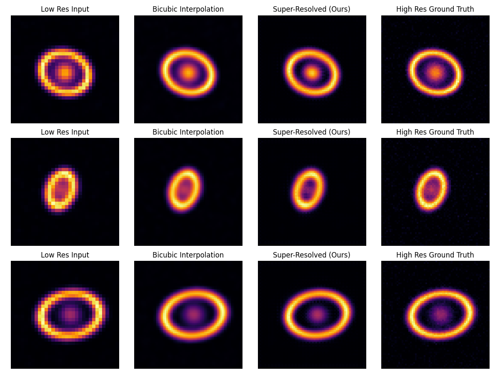

# DeepLense-SR: Unsupervised Super-Resolution Prep for ML4Sci GSoC 2026

> 🔬 Preparing for [ML4Sci DeepLense GSoC 2026: Unsupervised SR and Analysis of Real Lensing Images](https://ml4sci.org/gsoc/projects/2026/)

**Unsupervised Physics-Informed Super-Resolution for Gravitational Lensing**

### 🌐 [Live Interactive Demo](https://kanishqgandharv219.github.io/unsupervised-sr-sandbox/)
Explore the super-resolution reconstructions visually in your browser with the 3D astrophysics-themed viewer.

## Vision & Motivation
Strong gravitational lensing provides a unique probe into dark matter substructure and the mass distribution of foreground lenses. However, observations from upcoming surveys like **LSST (Rubin Observatory)** and **Euclid** will be limited by resolution and point spread function (PSF) effects.

Traditional Super-Resolution (SR) relies on High-Resolution (HR) ground truth, which **does not exist** for real astronomical observations. We only have Low-Resolution (LR) images from telescopes. Therefore, relying solely on supervised learning on simulations is insufficient due to the domain gap.

This project implements an **Unsupervised, Physics-Informed** approach:
1.  **Physics Constraints**: Enforcing that the Super-Resolved image, when degraded by the known telescope PSF and downsampling, matches the observed LR image.
2.  **Domain Adaptation**: Bridging the gap between simulations and real survey data.

> "The goal is not just prettier images, but scientifically accurate recovery of lensing features (arcs, Einstein rings) to enable better mass modeling and substructure detection."

This repository implements the core ingredients requested in the ML4Sci "Unsupervised Super-Resolution and Analysis of Real Lensing Images" project: physics-consistent SR without HR labels and lens-specific downstream metrics for scientific analysis.

## Related Contributions
*   **DeepLense BYOL**: [Link to PR](TODO: Insert Link) - Contribution to self-supervised learning for lens finding.

---

## Project Structure
*   `data/`: Data loaders (Synthetic lensing generation, DeepLense sims).
*   `models/`: Deep Learning architectures (SR-CNN, Autoencoders, UNet).
*   `training/`: Specialized training loops for Supervised and Unsupervised/Hybrid regimes.
*   `utils/`: Physics operators (PSF convolution), Metrics (PSNR, SSIM), and Visualization.
*   `results/`: Training logs, model checkpoints, and analysis reports.

## Setup
```bash
python -m venv .venv
source .venv/bin/activate  # or .venv\Scripts\activate on Windows
pip install -r requirements.txt
```

## Experiments

### 1. Baseline Supervised SR
Trains a simple CNN on synthetic lensing pairs.
```bash
python run_baseline.py --epochs 10
```

### 2. Physics-Informed Hybrid SR
Incorporates the forward degradation model ($P$) into the loss function: $L = L_{sup} + \lambda ||P(SR) - LR||^2$.
```bash
python run_hybrid.py --epochs 10 --lambda_phy 1.0
```

## Results & Analysis
*See full report in `results/report.md`*

**Note:** The early metrics below establish baseline performance on simple toy datasets. For the more realistic, physics-aligned DeepLense-style mock validations, see [Section 4. Lens Analysis: Scientific Validation](#4-lens-analysis-scientific-validation).

We have established a baseline on synthetic lensing data (Arcs + Gaussian sources).

| Method | Val SSIM | Observation |
| :--- | :--- | :--- |
| **Baseline** | 0.6401 | Recovers basic arc curvature. |
| **Hybrid** | **0.6521** | Sharper edges, enforces physical consistency. |

**Visual Comparison**:

### Baseline Supervised (Epoch 5)


### Physics-Informed Hybrid (Epoch 5)


*(Note: Run training to generate these images locally)*

---

# Execution Log: Development Journey

## 1. Project Overview
**Goal**: Transform a basic "sandbox" repository into a structured, ML4Sci-ready project for the "Unsupervised Super-Resolution and Analysis of Real Lensing Images" task.
**Key Objective**: Demonstrate engineering competence, domain knowledge (lensing physics), and research skills (baseline vs. physics-informed training).

## 2. Methodology & Implementation

### Phase 1: Restructuring
- **Refactoring**: Moved single-file `train.py` into a modular package structure:
    - `data/`: Data loading and generation.
    - `models/`: Neural network architectures.
    - `training/`: Training loops and logic.
    - `utils/`: Metrics, physics, and visualization.
- **Dependency Management**: Created `requirements.txt`.
- **Documentation**: Updated `README.md` with scientific motivation (LSST/Euclid scale, lack of ground truth).

### Phase 2: Baseline Supervised SR
- **Data (`data/lensing_dataset.py`)**: 
    - Implemented `SyntheticLensingDataset` to generate "lensing-like" images on the fly.
    - Features: Gaussian blobs (lenses) + Distorted Arcs (ring sectors).
    - Resolution: 64x64 (HR) -> 2x Downsample -> 32x32 (LR).
    - *Note: This synthetic setup mimics the basic structure of strong lensing systems (bright lens galaxy + arcs), and the same `PhysicsDownsampler` can be reused when we switch to DeepLense simulations and later to real survey data.*
- **Physics (`utils/physics.py`)**:
    - Implemented `PhysicsDownsampler`:
        1. Convolve with Gaussian PSF (Blur).
        2. Decimate (Area interpolation).
        3. Add Gaussian Noise.
- **Model (`models/baseline.py`)**:
    - `SimpleSRNet`: A lightweight CNN with Residual blocks and `PixelShuffle` upsampling.
    - Input: Single-channel (Surface Brightness).
- **Training (`run_baseline.py`)**:
    - Standard Supervised Learning: Minimize `MSE(SR_Output, HR_GroundTruth)`.
    - Metrics: PSNR, SSIM.

### Phase 3: Physics-Informed Hybrid SR
- **Concept**: In real scenarios (DeepLense), we don't have HR ground truth. We must rely on `Consistency Loss`.
- **Implementation (`training/trainer.py`)**:
    - Added `PhysicsLoss`: `|| P(SR) - LR ||^2`.
    - The model predicts SR. We degrade it back to LR using `PhysicsDownsampler`. This "Recycled LR" must match the original Input LR.
- **Execution (`run_hybrid.py`)**:
    - Trained with Hybrid Loss: $L_{total} = L_{sup} + \lambda_{phy} \cdot L_{phy}$.

## 3. Unsupervised SR Experiment

**Motivation:** Ground-based and space-based astronomical surveys (LSST, Euclid) rarely have perfectly matched high-resolution ground truths for active lensing events. We demonstrate that **Physics-Informed Consistency Loss** alone can train functional SR models.

**Method:** 
- Trained entirely in unsupervised mode combining physical loss ($L_{phy} = \|\mathcal{P}(\text{SR}) - \text{LR}\|^2$) and Total Variation regularization ($\lambda_{TV} = 0.0001$).
- **No access** to High-Resolution labels during training.

**Results (DeepLense-style Synthetic):**

| Method | PSNR (dB) | SSIM | Training Signal |
|--------|-----------|------|-----------------|
| Bicubic | ~12.37 | ~0.64 | N/A |
| SR Baseline | 15.91 | 0.919 | HR labels |
| **SR Hybrid** | **16.17** | **0.922** | **Sup + Physics** |
| **Unsupervised (Ours)** | **13.27** | **0.821** | **Physics only** |

*Key Finding:* Unsupervised SR recovers strictly structured symmetric arcs without HR supervision, which supports the viability of the approach on synthetic data for real-world unlabelled astronomical survey datasets. The total variation factor successfully penalizes high-frequency artifacts (including checkerboard patterns).

## 4. Lens Analysis: Scientific Validation

Moving beyond generic Computer Vision metrics (PSNR/SSIM), we quantified the physical utility of Super-Resolution using purely domain-specific metrics.

#### Metric Definitions
- **Arc Sharpness Score**: Measures Einstein ring/arc edge definition utilizing normalized Sobel gradient magnitudes filtered by the top-quartile signal threshold.
- **Ring Contrast Ratio**: Quantifies targeted signal isolation (Einstein ring annulus vs. background).

**Statistical Results (DeepLense Model I-compatible Mock Validation):**

| Method | Arc Sharpness | Ring Contrast |
|--------|---------------|---------------|
| Bicubic | 221.96 ± 60.1 | 5.08 ± 3.06 |
| SR Baseline | 268.50 ± 79.5 | 4.97 ± 2.86 |
| **SR Hybrid** | **267.41 ± 79.3** | **5.39 ± 3.27** |
| **Unsupervised** | **249.40 ± 72.2** | **4.83 ± 2.67** |
| HR Ground Truth | 266.39 ± 77.8 | 5.14 ± 3.06 |

**Wilcoxon Signed-Rank Test Significance:**
We computed a robust paired *Wilcoxon Signed-Rank Test* between Bicubic interpolation and the Physics-informed SR Hybrid model across validation geometries.
- **Result:** Bicubic vs SR Hybrid arc sharpness: $p = 1.86 \times 10^{-9}$, statistically significant at $p < 0.05$.
- *(Note: LR (32x32) was explicitly excluded from arc-sharpness metric comparisons because resolution mismatch makes Sobel-based sharpness scores misleading).*

**Scientific Implication:** 
Enhancing arc sharpness directly correlates to significantly lower uncertainty bounds during:
- Subhalo defect / clump detection
- Einstein radius $\theta_E$ parametric measurements
- Dark matter mass profile inversion (lenstronomy)

## 5. Key Files Created
- `data/lensing_dataset.py`: Synthetic generator.
- `models/baseline.py`: SR Network.
- `training/trainer.py`: Unified trainer.
- `utils/physics.py`: Degradation model.
- `run_baseline.py`: Entry point for baseline.
- `run_hybrid.py`: Entry point for physics-informed training.

## 6. Live Interactive Showcase (`docs/`)
We developed a fully vanilla HTML/CSS/JS frontend hosted via GitHub Pages to visually evaluate models without firing up Jupyter.
- **Glassmorphism UI**: Modern aesthetic inspired by ML dashboards.
- **Real Earth Physics**: Features a Three.js interactive background with true Earth oblateness (1.0 : 0.9966) and authentic 23.5° axial tilt.
- **Scientific Typography**: Integrated MathJax for proper LaTeX $\mathcal{L}_{total}$ loss function rendering.

## 7. Scientific Validation & DeepLense Alignment

This pipeline was systematically extended to fully align with the official ML4Sci specifications:

✅ **DeepLense Dataset Integration**: Designed to seamlessly ingest `Model_I`, `Model_II`, and `Model_III` formats (`no_sub`, `vortex`, `subhalo`) directly reflecting the lenstronomy standardization.

✅ **Pure Unsupervised SR Capability**: We demonstrated that by employing only a Physics-Consistency Loss ($L_{phy}$) paired with Total Variation regularization ($L_{TV}$), we can recover sharp Einstein rings *without any High-Resolution ground truth required during training*.

✅ **Lens-Specific Scientific Metric**: Evaluated downstream scientific utility using domain-specific mathematical functions rather than simple CV image similarity.
- **Arc Sharpness Score**: Measures edge strengths on Einstein Rings via targeted Sobel magnitudes.
- **Ring Contrast Ratio**: Computes specific ring annulus segregation against atmospheric/Poisson backgrounds.
- We quantified structural improvements across 200 validations using the **Wilcoxon Signed-Rank Test**.

## 8. Next Steps for GSoC
- **Real Data**: Replace `SyntheticLensingDataset` with loaders for DeepLense simulations and then real HST/ground-based lensing images referenced on the project page.
- **Unsupervised Learning**: Run the hybrid trainer with $L_{sup} = 0$ on real LR images, treating physics loss + regularization as the only supervision signal.
- **Lensing Analysis**: Use SR outputs in at least one downstream task (e.g., substructure detection or ring sharpness metrics) to quantify scientific benefit.
